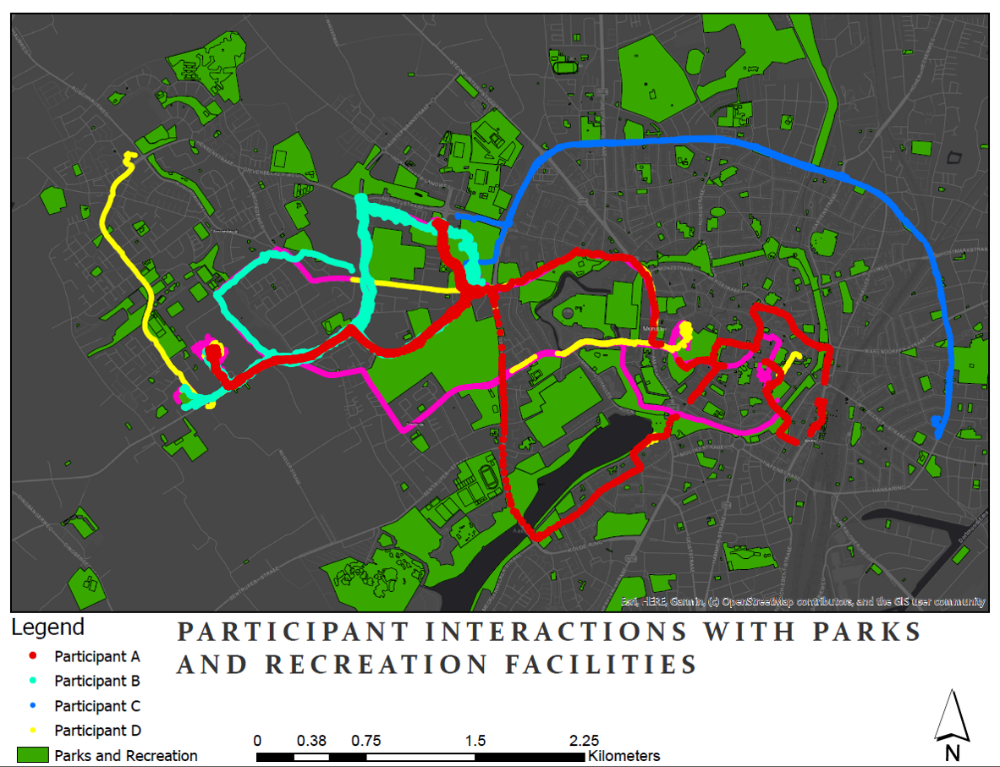

## Portfolio

---

[Integrating Openstreetmap Data and Sentinel-2 Imagery for Classifying and Monitoring Informal Settlements](/pdf/INTEGRATING OPENSTREETMAP DATA AND SENTINEL-2 IMAGERY FOR CLASSIFYING AND MONITORING INFORMAL SETTLEMENTS.pdf)

---

[Lisbon Tourism Web App](/pdf/Lisbon Tourism Web App.pdf)

---

[Correlation Between an Eagle Owl’s Flight Height and Mean Monthly Temperature - Python in GIS](/pdf/Correlation Between Eagle Owl’s Flight Height and Mean.pdf)

---

- [Synthetic Aperture Radar (SAR)- Differential Interferometry and DEM Production Using Sentinel-1](/pdf/SAR Class Project_Brenda Ayo.pdf)

---

- [Using GPS and GIS to Analyze the physical activity of IFGI students](/pdf/Using GPS and GIS to Analyze the physical activity of IFGI students.pdf)

---
