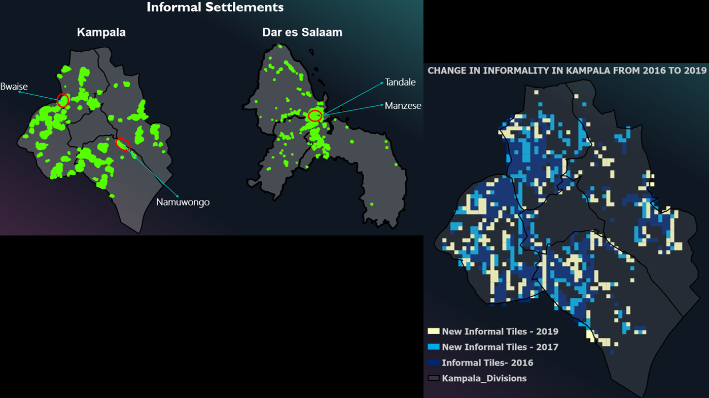
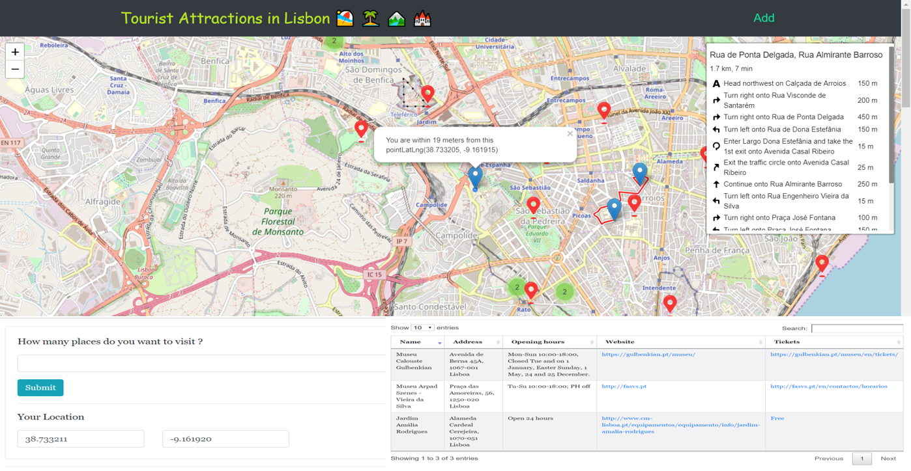

## Portfolio

---

[Integrating Openstreetmap Data and Sentinel-2 Imagery for Classifying and Monitoring Informal Settlements](/pdf/INTEGRATING OPENSTREETMAP DATA AND SENTINEL-2 IMAGERY FOR CLASSIFYING AND MONITORING INFORMAL SETTLEMENTS.pdf)

---

[Lisbon Tourism Web App](/pdf/Lisbon Tourism Web App.pdf)

---

[Project 3 Title](http://example.com/)

---

- [Project 1 Title](http://example.com/)

---

- [Project 2 Title](http://example.com/)

---

- [Project 3 Title](http://example.com/)

- [Project 4 Title](http://example.com/)
- [Project 5 Title](http://example.com/)

---

---

Page template forked from <a href="https://github.com/evanca/quick-portfolio">evanca</a>

<!-- Remove above link if you don't want to attibute -->
